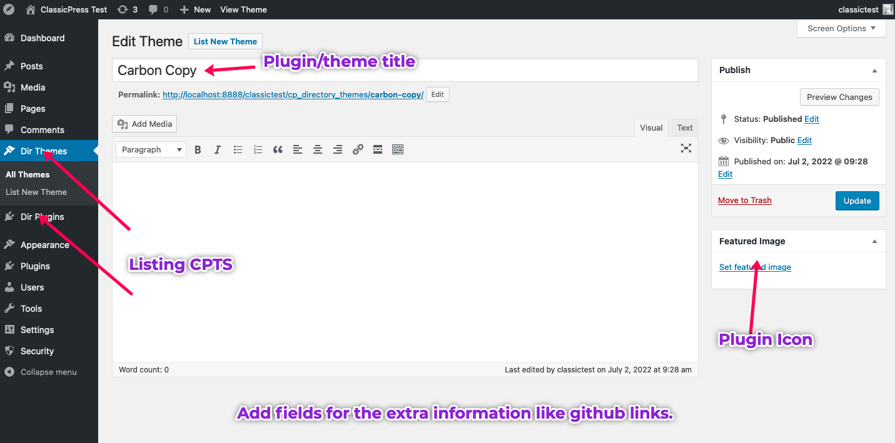
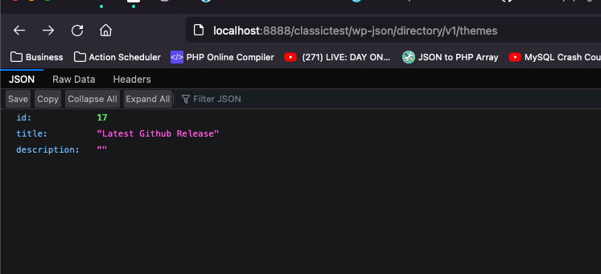

# CP Directory Proposal

CP Directory Proposal with REST API Endpoint for themes and plugins.

## How to use
- Install the plugin via the WP plugin installer.
- Activate the plugin.
- Navigate the plugin to see options

## Features

### Rest API Fields
How to access the REST custom fields, visit one of the rest endpoints like 
```
 * domain/wp-json/directory/v1/plugins
 * domain/wp-json/directory/v1/themes
```

See the screenshot below:




## Hooks

## Filter Hooks

### Action Hooks
`do_action( 'add_blockli_submenu_items' )`  - Adds new items to the menu after the settings panel. No arguments passed.